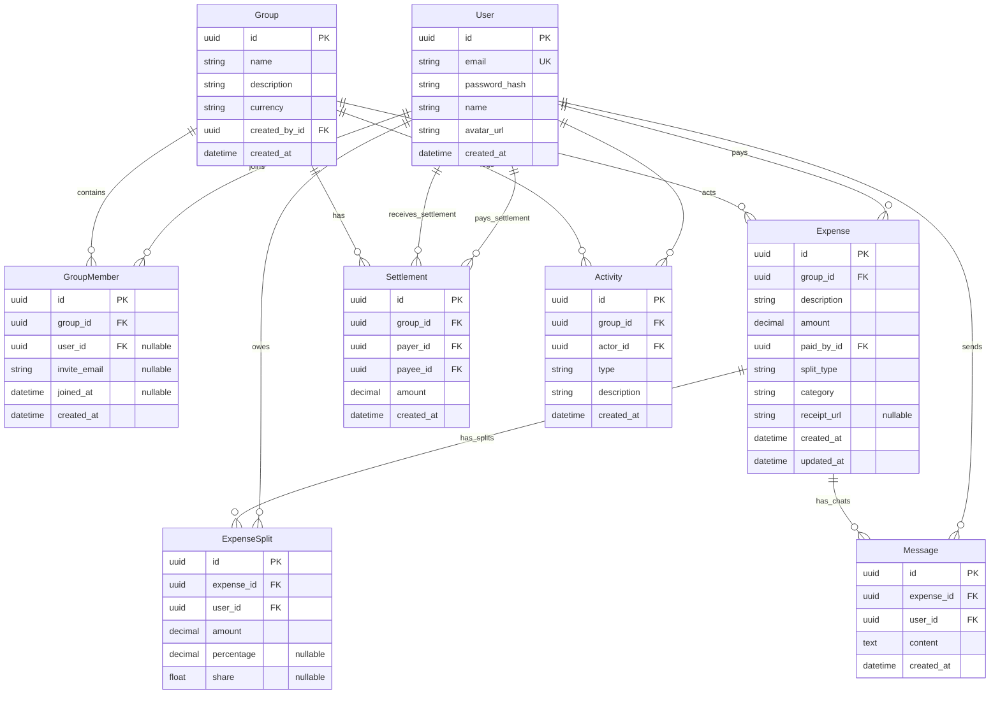

# AI Context: Splitwise Clone App

This file is the single source of truth for the Splitwise Clone application. It details the product specification, technical architecture, database schema, API contracts, UI structure, and implementation decisions.

---

## 1. Product Understanding & Scope

### Target Audience & Core Objective
A simplified, premium-designed Splitwise clone (SettleUp / HisabKitab) to manage group expenses, split bills dynamically, view real-time chat updates on expenses, track individual/group balances, and record debt settlements.

### Core Features
1. **User Authentication & Login:**
   - Sign up with Name, Email, and Password.
   - Login with Email and Password.
   - JWT-based authentication with storage in local storage for API requests.
   - Auto-generated initials avatar for users without a profile picture.

2. **Group Management:**
   - Create a Group (Name, Description, Group Currency).
   - Add/invite members to a Group by their email.
     - *Feature:* If the invited email is already registered, they are added immediately. If not, they are marked as a "pending invite". When that user signs up later, they are automatically added to the group.
   - Remove members from a Group (only allowed if the member's net balance in the group is exactly zero).

3. **Expense Management & Categories:**
   - Create, edit, and delete expenses within a group.
   - Expense attributes: Description, total amount, date, payer (one user), split type, category, and receipt image URL.
   - **Supported Categories:** Food, Travel, Shopping, Rent, Entertainment, Utilities, and Others. Each expense belongs to one category (defaults to 'Others').
   - **Supported Split Types:**
     - **Equal:** Split evenly among selected members.
     - **Unequal:** Specify exact amount owed by each participant. (Total must equal the expense amount).
     - **Percentage:** Specify percentage owed by each participant. (Total must equal 100%).
     - **Share:** Specify relative shares (e.g., User A: 2 shares, User B: 1 share).
   - **Rounding handling:** Any leftover rounding remainder is absorbed by the payer.
   - **Filters:** Expenses can be filtered by Category inside the Group view.

4. **Receipt Uploads:**
   - Users can upload a receipt image when creating or editing expenses.
   - Frontend validates file size (< 5MB) and type (PNG, JPG, GIF, WebP).
   - Saved locally in the backend (`/uploads`) and served statically. Displayed on the expense details page with click-to-zoom lightbox capability.

5. **Real-time Expense Chat:**
   - Instant messaging system inside each expense detail page.
   - Real-time updates using WebSockets (Socket.io).
   - Messages are persisted in the database so that chat history is retained.

6. **Balances & Settlements:**
   - **Group Dashboard:** Displays net group balance and pairwise debts ("who owes whom") with Greedy Debt Simplification.
   - **Settle Up:** Record a settlement payment manually to clear debt.

7. **Dashboard Analytics (Insights):**
   - General metrics: Total groups, total user spending share, total paid by me, owed to me, owed by me, net balance.
   - **Monthly Expense Chart:** Interactive SVG chart displaying user's spending share over the last 6 months.
   - **Category-wise Spending Breakdown:** Visual progress indicators showing user share amounts and percentages per category.

8. **Activity Feed (Group Timeline):**
   - Chronological list of events inside a group: group creation, members added/removed, expenses created/edited/deleted, settlements, and comments.

### Out-of-Scope Features
- Simplifying debts globally across multiple groups (only simplified within each individual group).
- Multiple currencies within a single group (currency is set at the group level).
- Exporting data to CSV/PDF.

---

## 2. Tech Stack & Architecture

- **Frontend:** React (Vite) Single Page Application.
- **Styling:** Custom CSS variables for the warm light creative theme (Teal `#0f766e` primary, forest green `#15803d` success, orange/saffron `#c2410c` danger, warm off-white `#faf9f6` bg).
- **Backend:** Node.js with Express and Multer (file upload processing).
- **WebSockets:** Socket.io for real-time chat messages.
- **Database:** PostgreSQL (Production) / SQLite (Local Development).
- **ORM:** Prisma ORM for database queries.

---

## 3. Database Schema

---

## 4. API Design

### Authentication
- `POST /api/auth/register` - Create user account
- `POST /api/auth/login` - Verify credentials and return JWT token
- `GET /api/auth/me` - Get current user profile

### Groups
- `GET /api/groups` - List all groups user is part of
- `POST /api/groups` - Create a new group
- `GET /api/groups/:id` - Get group details
- `POST /api/groups/:id/members` - Invite a member by email
- `DELETE /api/groups/:id/members/:userId` - Remove a member (only if balance is 0)
- `GET /api/groups/:id/activities` - Fetch activity timeline for the group

### Expenses
- `POST /api/groups/:groupId/expenses` - Create a new expense (computes splits, sets category & receiptUrl, logs activity)
- `GET /api/expenses/:id` - Get details of an expense (splits, receipt, chat history)
- `PUT /api/expenses/:id` - Edit an expense (recomputes splits, logs activity)
- `DELETE /api/expenses/:id` - Delete an expense (logs activity)

### Settlements
- `POST /api/groups/:groupId/settlements` - Record a payment settlement (logs activity)

### Chat Messages
- `GET /api/expenses/:expenseId/messages` - Get chat history

### Uploads, Analytics, Budgets, Recurring & Scanning
- `POST /api/upload` - Upload receipt image (requires file in `receipt` field, returns relative url)
- `GET /api/analytics` - Fetch user statistics, monthly trends, category breakdown, top spender, most active member, and largest expense
- `PUT /api/groups/:id/budget` - Set or update group budget limit
- `GET /api/groups/:groupId/recurring` - List all recurring expense rules in a group
- `POST /api/groups/:groupId/recurring` - Create a new recurring expense rule
- `PUT /api/recurring/:id` - Update or pause/resume a recurring expense rule
- `DELETE /api/recurring/:id` - Delete a recurring expense rule
- `POST /api/scan-receipt` - Analyze uploaded file and extract mock OCR details

---

## 5. Calculations & Logic

### Net Balance Calculation
For user $U$ in group $G$:
$$B = (L + S_{sent}) - (O + S_{rec})$$
*(L = Lent, O = Owed, $S_{sent}$ = Settlements paid by $U$, $S_{rec}$ = Settlements received by $U$)*

### Spending Analysis
Category-wise breakdowns and monthly trends are computed based on the user's **actual share of the bills** (i.e. `ExpenseSplit.amount` for that user), rather than the total amount of expenses they paid for. This gives a true reflection of the user's consumption.

---

## 6. Trade-offs & Design Decisions

- **Local Receipt Uploads**: Uploads are written directly to disk (`backend/uploads/`) and served statically. This keeps installation self-contained and avoids dependencies on external S3 buckets, but limits horizontal scaling.
- **Dependency-Free SVG Charting**: Renders graphs natively in React using HTML/SVG vectors instead of pulling in bulky charting packages (e.g. Chart.js). This ensures complete styling control, dark mode compatibility, and zero build overhead.
